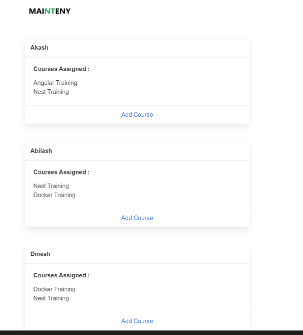
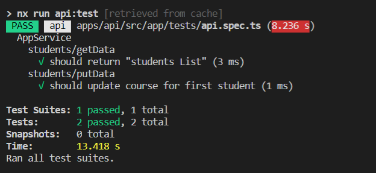
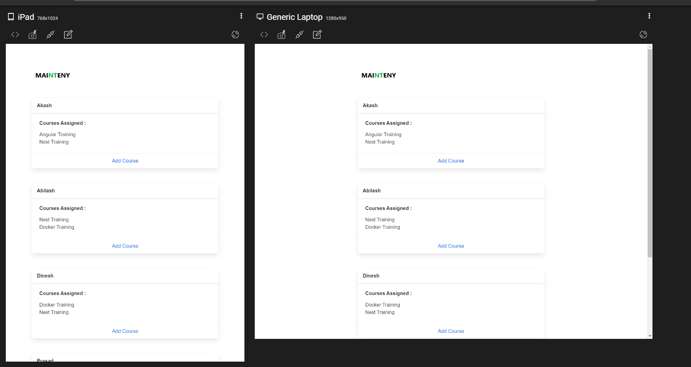
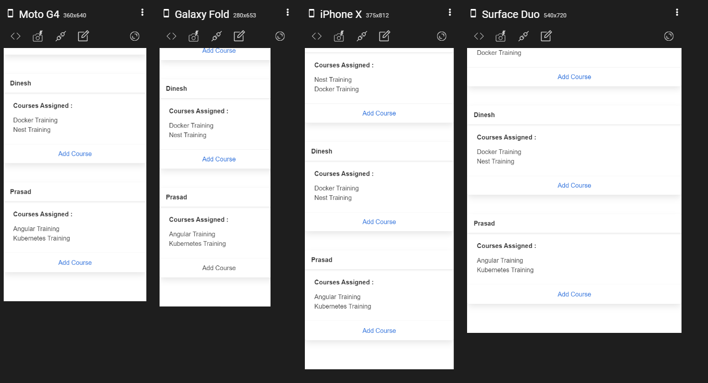

# Mainteny Coding Assigment

This project is a Monorepo of Angular and Nest created using Nx Extensible Dev Tools for Monorepos.

Choosed Nx monrepo for fast prototype.

Mainteny CA is a coding assignment for a small application which admin can see students list with courses assigned and he can assign remaining courses which are not assigned.

## Development server

Angular frontend :`ng serve frontend` to run in localhost 4200

Nest backend`ng serve api` to run in localhost 3333

## Build

Run `ng build my-app` to build the project. The build artifacts will be stored in the `dist/` directory. Use the `--prod` flag for a production build.

## Running unit tests

Run `ng test <appName>` to execute the unit tests via [Jest](https://jestjs.io).

Implemented only 2 test cases in backend

**Test results**

## Application Snapshot on all devices

## Docker Files

Created 2 docker files for both api and frontend and also a docker compose file to trigger.

commands to create image of those docker files

> docker image build -t maintenycaapi -f api.dockerfile ./

> docker image build -t maintenycaapp -f frontend.dockerfile ./

Command to run docker compose

> docker-compose up -d
